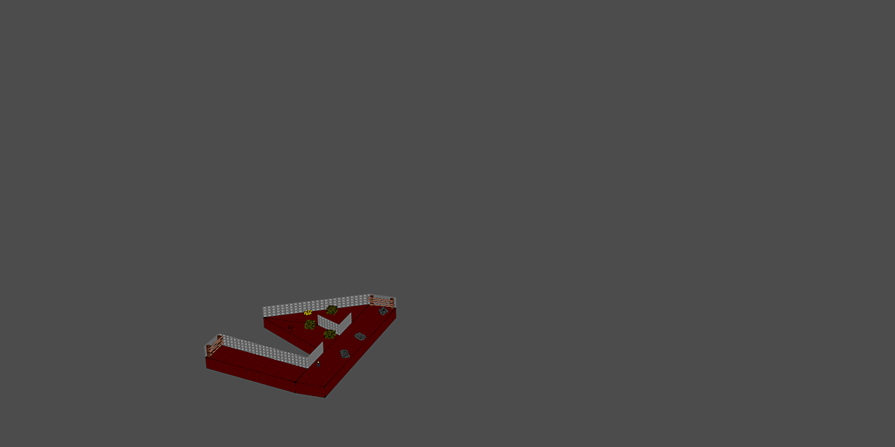

# Maze generation system for [godot-mapper](https://github.com/ELF32bit/godot-mapper) plugin
 
This maze generation system automates the assembly of modular rooms. 
The rooms are joined together via a minimal **`func_connector`** brush entity. 
Self-intersections are prevented by performing **AABB** checks of map brushes. 

## Explanation of the system
**`func_connector`** entity is a simple box with an **`angle`** of entrance. 
The build system will automatically find boxes with unique sizes to join. 
Joinable rooms for each connector are provided by adding **`next`** property. 
Here's a value example - `{ "rooms/01-aleph": 50%, "rooms/00-BREAK": 50% }`. 
Other room entities can specify **`maze_ignore`** property to disable **AABB** checks. 

Maze generator supports the following options. 
* **`maze_seed`** is a unique layout of the maze.
* **`maze_max_depth`** for how deep the maze can reach.
* **`maze_unpack`** will unpack rooms as unique nodes.

> Unpacking is designed for isolated rooms locked by doors.

Global room configuration is defined in **`func_connector+.gd`** script. 
**Uppercased** naming convention is used for the maps that seal exits. 

## How to create interesting rooms
Getting procedural generation right is very difficult without a direction. 
22 example rooms are based on the letters of **Phoenician/Hebrew** alphabet. 
Languages provide memorable shapes for the rooms as well as how they naturally join. 
Moreover, the letters can be further classified to give a special meaning to each room. 
There are 3 mother letters, 7 doubles and 12 simples according to Sefer Yetzirah. 
